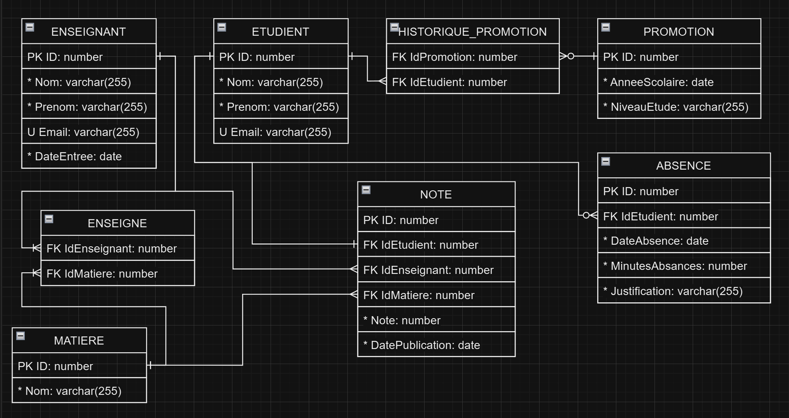

# 1SGBD

Base de données pour le projet de fin de module 1SGBD

**Table of contents:**

1. [Consigne](#système-de-gestion-informatique-pour-une-école)
2. [Exercices](#questions)

## Système de gestion informatique pour une école

### Introduction

Cet examen est **individuel** et se déroule sans soutenance. Sa durée est de **deux semaines.**

Votre rendu s’effectuera sous la forme d’une archive au format zip contenant vos ressources à la réalisation de l’examen. Il est attendu que vous testiez votre code et que vos scripts fonctionnent correctement avant de rendre votre projet.

Le projet est un cas pratique, vous devez proposer une solution adaptée qui répond aux besoins du client. Il est fortement recommandé de lire l’intégralité de l’énoncé avant de commencer le projet.

### Le client

Une école informatique souhaite moderniser la gestion de son système d’information pour optimiser le suivi des étudiants, des enseignants et des notes. Ils désirent mettre en place une base de données relationnelle pour centraliser les données et s’assurer de ne pas perdre les données. À savoir que :

* ***Les enseignants :*** ont une date d’entrée dans l’école, un nom, un prénom et une adresse email unique. Un enseignant va pouvoir être assigné à une ou plusieurs matières, une table en plus sera nécessaire pour sauvegarder cette information.

* ***Les étudiants :*** ont un nom, prénom, une adresse email unique et une promotion.

* ***Les notes :*** Chaque note sera assignée à un étudiant pour une matière, évaluée par un enseignant et avec une date de publication, on va donc vouloir sauvegarder ces informations. Un étudiant ne peut avoir qu’une seule note pour la même matière, on aura donc une contrainte pour ça.

L’école souhaite historiser les données, c’est-à-dire que même si un étudiant ne peut appartenir à une seule promotion chaque année, on souhaite pouvoir connaître les promotions des années précédentes (cela est utile pour les étudiants qui ont redoublé par exemple).

Enfin l’école souhaite ajouter une gestion des absences des étudiants, pour chaque retard l’école va sauvegarder l’information dans la Base De Données. Ensuite, l’école pourra faire des rapports pour prendre des décisions en cas d’abus. Une absence va donc sauvegarder une date, le nombre de minutes du retard et si l’absence a été justifiée oui ou non.

### Questions

Dans cette partie, l’objectif est de proposer une structure de Base De Donnée au client que vous allez concevoir pour gérer les données de l’école. Commencez par proposer un schéma UML (de type ERD : **E**ntity **R**elationship **M**odeling) qui sera partagé avec le client pour aider à comprendre le schéma. Vous pouvez ajouter des attributs et des tables supplémentaires pour répondre aux besoins, le nom des tables et des attributs. C’est à vous de déterminer les types des attributs. (**15 pts**).

On va aussi faire attention de bien normaliser le schéma à la troisième Forme Normal, donc 3FN. (**5 pts**)

Ensuite, écrire un script dans un fichier .sql qui est capable de générer toute la structure de la BDD : tables, colonnes, relations, contraintes (clés primaires, étrangères, uniques, etc.), etc. (**10 pts**).

Enfin, le client souhaite obtenir des requêtes SQL pour communiquer avec la Base De Donnée pour faire des analyses.

1. Écrire une requête SQL qui retourne la liste des étudiants. Pour chaque étudiant on souhaite seulement afficher les colonnes « nom » et « prénom » que l’on va renommer respectivement en « last_name », « first_name ». (**2 pts**)

2. Proposer une requêtes SQL qui affiche la liste des retards des étudiants considéré comme non justifiés et de plus de dix minutes. On va ordonner les résultats par temps de retard descendant, donc du retard le plus long au plus cours. (**2 pts**).

3. Afficher toutes les notes comprises entre et 15 et 20 qui ont été publié pendant l’année en cours. Pour chaque note, on souhaite aussi afficher le nom et prénom de l’étudiant et l’adresse email de l’enseignant qui a publié la note (**6 pts**)

### BONUS

Proposer un script .sql qui utilise des requêtes INSERT pour insérer une série de données dans votre nouvelle base de données. (**4 pts**)

Note : *La requête INSERT sera vue en détail l’année prochaine pendant le cours 2SGBD. Prenez une étape d’avance en essayant le bonus !*
